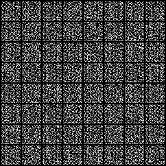
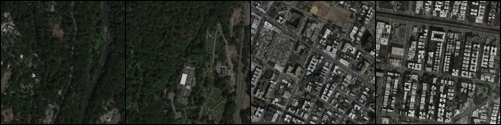
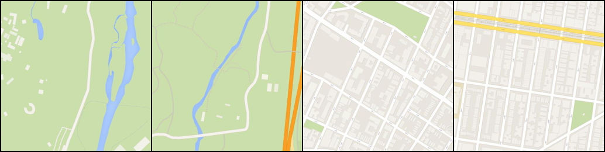
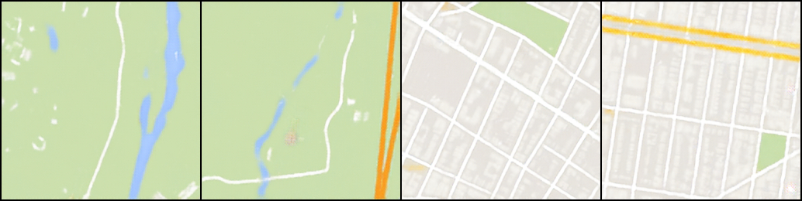
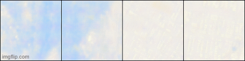

<h1> Things I've done with Generative Adversarial Networks.</h1>

<h3>DCGAN</h3>
<h3>Training a DCGAN on MNIST Handwritten Digits Dataset</h3>

 Progress from generating random noise to distinguishable digits.</img>

<h3>Pix2Pix</h3>
<h3>Training Pix2Pix on Maps Dataset</h3>

 <pre>             </pre>Satellite Source Image</img>  
 Ground Truth</img>  
 Generated Map View</img>  
 Training progress visualized across epochs.</img>
