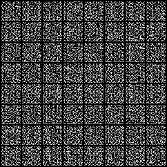

<h1> Things I've done with Generative Adversarial Networks.</h1>

<h3>Training a DCGAN on MNIST Handwritten Digits Dataset</h3>
<h4>1.DCGAN</h4>
Progress from generating random noise to distinguishable digits.</img>
